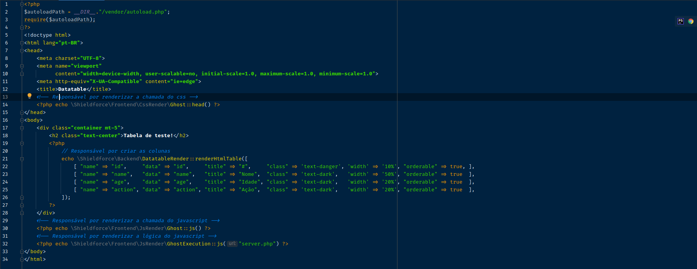
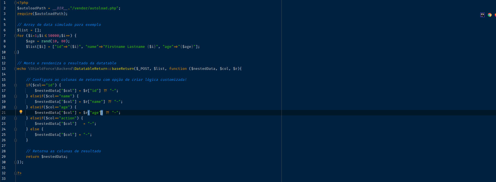

### Pacote datatable __*Shieldforce*__

## Requisitos:

- [x] PHP >= 8.1
- [x] Composer >= 2
- [x] Autoload Ligado

### Instalando pacote:
```
composer require shieldfroce/datatable:1.0.0
```

### Exemplo de implementação simples (Frontend)!:



### Responsável por renderizar a chamada do css:
```
<?php echo \Shieldforce\Frontend\CssRender\Ghost::head() ?>
```

### Responsável por criar as colunas:
```
<?php 
    echo \Shieldforce\Backend\DatatableRender::renderHtmlTable([
        [ "name" => "id",     "data" => "id",     "title" => "#",     "class" => 'text-danger', 'width' => '10%', "orderable" => true, ],
        [ "name" => "name",   "data" => "name",   "title" => "Nome",  "class" => 'text-dark',   'width' => '50%', "orderable" => true  ],
        [ "name" => "age",    "data" => "age",    "title" => "Idade", "class" => 'text-dark',   'width' => '20%', "orderable" => true  ],
        [ "name" => "action", "data" => "action", "title" => "Ação",  "class" => 'text-dark',   'width' => '20%', "orderable" => true  ],
    ]);
?>
```

### Responsável por renderizar a chamada do javascript:
```
<?php echo \Shieldforce\Frontend\JsRender\Ghost::js() ?>
```

### Responsável por renderizar a lógica do javascript:
```
<?php echo \Shieldforce\Frontend\JsRender\GhostExecution::js("server.php") ?>
```
---
### Exemplo de implementação simples (Backend)!:



### // Array de data simulado para exemplo:
```
$list = [];
for ($i=1;$i<=50000;$i++) {
    $age = rand(10, 80);
    $list[$i] = ["id"=>"{$i}", "name"=>"Firstname Lastname {$i}", "age"=>"{$age}"];
}
```

### // Monta e rendeniza o resultado da datatable:
```
echo \Shieldforce\Backend\DatatableReturn::baseReturn($_POST, $list, function ($nestedData, $col, $r){

    // Configura as colunas de retorno com opção de criar lógica customizada!
    
    if($col=="id") {
        $nestedData["$col"] = $r["id"] ?? "-";
    } elseif($col=="name") {
        $nestedData["$col"] = $r["name"] ?? "-";
    } elseif($col=="age") {
        $nestedData["$col"] = $r["age"] ?? "-";
    } elseif($col=="action") {
        $nestedData["$col"]   = "-";
    } else {
        $nestedData["$col"] = "-";
    }

    // Retorna as colunas de resultado
    
    return $nestedData;
});
```